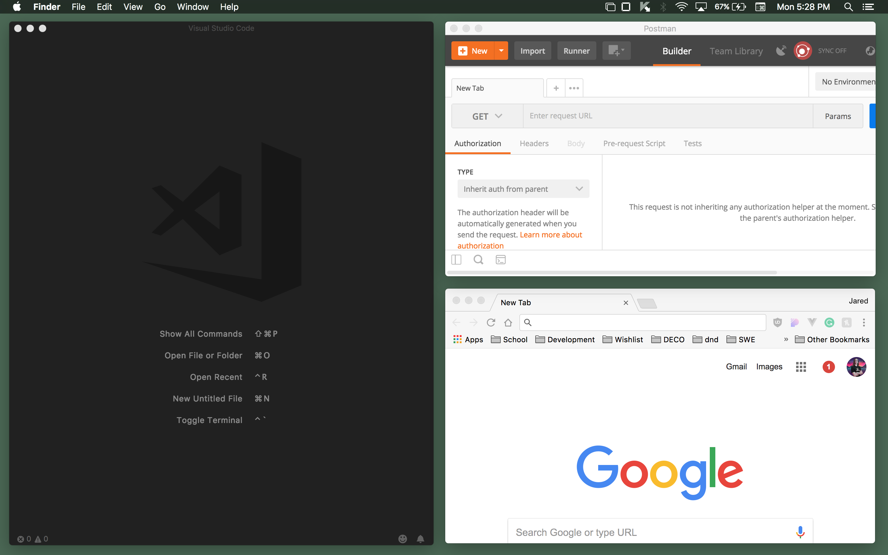

# Phoenix Padding
A simple [phoenix](https://github.com/kasper/phoenix) setup that provides padding between the windows.

Uses a *super mod* <kbd>ctrl + alt + cmd</kbd> that I have bound to <kbd>caps lock</kbd> thanks to [fabiospampinato](https://github.com/fabiospampinato/phoenix) phoenix setup. 

### Window Sizing Shortcuts

**Left Half:**
<kbd>j</kbd> + <kbd>[ctrl + alt + cmd]</kbd>

**Right Half:**
<kbd>k</kbd> + <kbd>[ctrl + alt + cmd]</kbd>

**Top Right Corner:**
<kbd>w</kbd> + <kbd>[ctrl + alt + cmd]</kbd>

**Bottom Right Corner:**
<kbd>s</kbd> + <kbd>[ctrl + alt + cmd]</kbd>

**Top Right Corner:**
<kbd>q</kbd> + <kbd>[ctrl + alt + cmd]</kbd>

**Bottom Left Corner:**
<kbd>a</kbd> + <kbd>[ctrl + alt + cmd]</kbd>

**Maximize (not fullscreen):**
<kbd>m</kbd> + <kbd>[ctrl + alt + cmd]</kbd>

### Focus Shortcuts

**Gain Focus**
Focus the most recent window if no windows are focused, shows error modal if no windows avaliable to focus
<kbd>l</kbd> + <kbd>[ctrl + alt + cmd]</kbd>

**Focus North Neighbor:**
<kbd>w</kbd> + <kbd>[ctrl + alt + cmd]</kbd> + <kbd>shift</kbd>

**Focus South Neighbor:**
<kbd>s</kbd> + <kbd>[ctrl + alt + cmd]</kbd> + <kbd>shift</kbd>

**Focus East Neighbor:**
<kbd>d</kbd> + <kbd>[ctrl + alt + cmd]</kbd> + <kbd>shift</kbd>

**Focus West Neighbor:**
<kbd>a</kbd> + <kbd>[ctrl + alt + cmd]</kbd> + <kbd>shift</kbd>

### Bonus Shortcuts

**Show Visible Window Info:**
Show icons and names of all visible windows at the center of the window
<kbd>i</kbd> + <kbd>[ctrl + alt + cmd]</kbd>